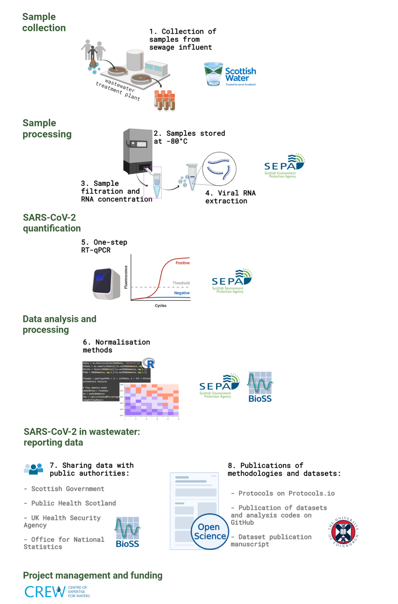

 
# Methodology

*Flow chart ilustrating the steps from sample collection to final data.*

The wastewater samples were collected by Scottish Water and its operators and SEPA. Samples were collected from sewage 
influent using either autosamplers over a period of 24 hours or, in some cases, by means of a grab sample via manholes. 
The frequency of sample collection was variable, but typically samples were collected on a weekly 
basis, once or twice a week. During outbreaks, for example, sample collection was more frequent in some of the health 
board areas. The samples were then transferred to SEPA laboratories where they were stored, processed and analysed. 
In general, it took one to two days from sample collection to data 
analysis and another two days for reporting the data on SEPA’s public dashboard. 

The detailed methodology, from wastewater viral RNA isolation to SARS-CoV2 detection using RT-qPCR and data analysis, is 
described on protocols.io (see Protocols).

A brief description of the methodology for quantification of SARS-CoV-2 in wastewater is presented here as follows.  

## Sample analysis: viral RNA extraction and RT-qPCR 

The majority of the samples were processed and analysed at SEPA’s laboratories whereas a few samples in January 2021 were 
processed and analysed by the Roslin Institute, University of Edinburgh.  

Prior to processing, the samples were spiked with a known quantity of Porcine Reproductive and Respiratory Syndrome 
(PRRS) virus as a sample process quality control. Then 
samples were clarified to remove particles and filter-concentrated to obtain sufficient viral RNA. 
RNA was then extracted, and SARS-CoV-2 gene copies (as well as the PRRS control) were quantified using one-step RT-qPCR. More 
specifically, the amplification of the SARS-CoV-2 nucleocapsid gene N1 was monitored. 

## Data analysis  

Depending on the amount of gene copies per litre obtained, samples were described as “Negative”, “Weak Positive”, 
“Positive Detected, Not Quantifiable” (“Positive DNQ”) or “Positive”. The cut-off values used to apply this description 
were determined by a standard dilution series analysis, which allowed the identification of the limit of detection (LoD) 
and the limit of quantification (LoQ) values. The LoD is the value at which the test has been determined to detect the 
virus material with certainty, and in this case it was set to be 1,316 gc/L. The LoQ is the value above which the test 
has been deemed to measure the virus material with a high degree of accuracy, and in this case was set at 11,368 gc/L. 

### Normalisation 

Although the gene copies per litre values described above are useful indicators of the presence of the virus in each 
specific site, they do not consider the dilution factor caused by the incoming flow in wastewater or the size of the 
population of each site. For example, in periods of heavy rainfall, the viral particles will be more diluted in the 
wastewater compared with periods with less rain. Additionally, in some areas the industrial discharges in wastewater will 
affect the incoming flow and therefore the viral concentration coming from household waste. The size of the population 
can also produce biases. A certain number of positive individuals in a small catchment area can produce higher values of 
viral gene copies compared with the same number of positive individuals in a larger catchment area. 

A better representation of the spread of the virus within the population can be derived from normalised values that use the site 
population and the incoming wastewater flow to determine the million gene copies per person per day. The detailed 
normalisation protocol is provided in the Protocols section. In short, to produce a daily value of million gene copies per 
person, the raw gene copies per litre value is multiplied by the daily flow total and divided by the population served at 
each site. The flow for a specific site (waterworks location) is either measured directly or estimated using an ammonia data.

 


