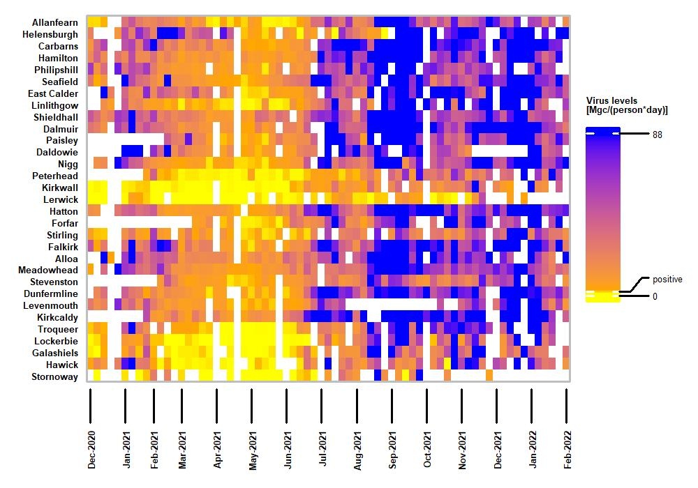

 

# SARS-CoV-2 Prevalence in Wastewater
SARS-CoV-2 is a novel coronavirus of animal origin that causes severe respiratory disease in humans (COVID19). During the 
early stages of the COVID19 pandemic, studies of infected patients have shown that SARS-CoV-2 RNA can be detected in the 
faeces of patients for weeks after the onset of clinical signs. There is no data with respect to faecal shedding prior to 
the onset of clinical signs, however modelling data suggests that faecal shedding at the start of an outbreak may be 
extremely high. Testing at wastewater treatment plants in a number of countries has identified evidence of SARS-CoV-2 RNA 
in municipal wastewater, but not plant effluent. Given the significant logistical limitations to testing people 
individually, testing of wastewater in the sewage network could provide valuable information as to the level of infection 
within communities. Determining the fate of viral RNA during wastewater processing is important to informing appropriate 
risk
assessments with respect to any potential hazard from SARS-CoV-2 in wastewater.

*Heatmap showing viral RNA levels over time at selected sampling sites. This figure was generated for the data paper, to illustrate key features of the data across the Alpha, Delta and Omicron waves.*

* The prevalence data is currently published in preprint form on MedRxiv .[SARS-CoV-2 RNA levels in Scotland's wastewater](https://www.medrxiv.org/content/10.1101/2022.06.08.22276093v1)

* The "live" data from Covid monitoring are available from [SEPA RNA monitoring of SARS-CoV2 
website](https://informatics.sepa.org.uk/RNAmonitoring/).

* The dataset from COVID monitoring up to 2022-02-14 is published as a data paper: [LINK]() and a Zenodo deposit [https://doi.org/10.5281/zenodo.6339631](https://doi.org/10.5281/zenodo.6339631)

* The complete data set in various formats is also available at GitHub: 
[COVID-Wastewater-Scotland](https://github.com/BioRDM/COVID-Wastewater-Scotland)

[Source](https://www.crew.ac.uk/publication/tracking-sars-cov-2-municipal-wastewater)



